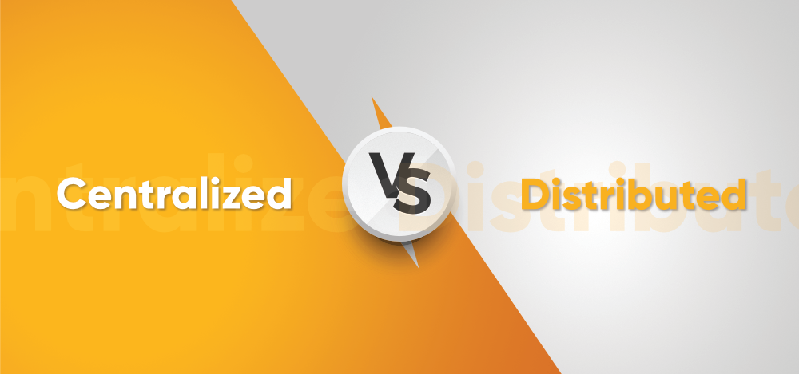
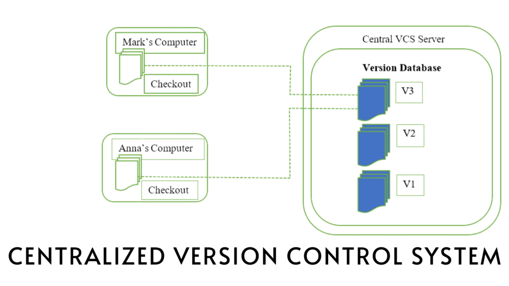
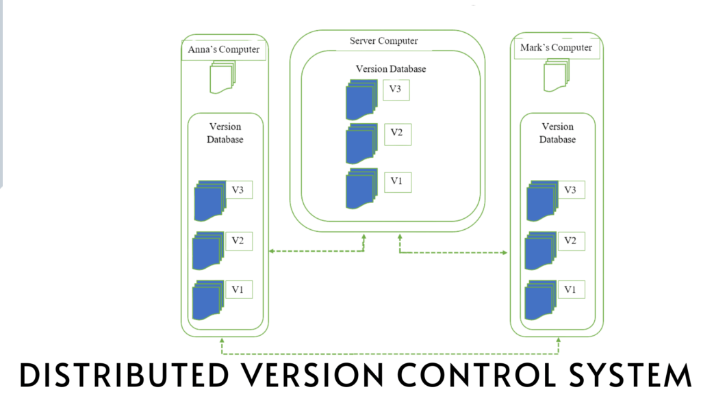

# Centralized Version Control vs Distributed Version Control

In the world of software development, managing changes to the code is crucial. Version control systems help developers keep track of code changes, collaborate effectively, and ensure that everything runs smoothly. There are two main types of version control systems: Centralized Version Control (CVC) and Distributed Version Control (DVC). Let's break down what these are and why DVC might be better than CVC.

## Centralized Version Control

Imagine you and your friends are working on a group project, and you keep all your files in one central location, like a single computer. To work on the project, everyone has to connect to that computer. This is essentially how Centralized Version Control works. A central server holds all the versions of your code, and developers check out (or download) the code from this server to make changes. When they're done, they check in (or upload) their changes back to the server.

Examples of centralized version control systems include Subversion (SVN) and Perforce.

### Drawbacks of Centralized Version Control

While Centralized Version Control was revolutionary when it first appeared, it has several significant drawbacks, especially when compared to Distributed Version Control:

- Single Point of Failure:
  - If the central server goes down or becomes inaccessible, no one can access the code or make updates. This can halt the entire development process.
  - If the server's data gets corrupted, it can lead to a loss of all the project's history and versions.

- Limited Offline Work:
  - Developers need to be connected to the central server to make any significant progress. If you're on a plane or in a location without internet access, you can't commit your changes or get the latest version of the code.

- Scalability Issues:
  - As more developers join a project, the central server can become overloaded with requests, slowing down the entire team's workflow.

- Performance Bottlenecks:
  - Every operation that requires communicating with the server (like committing changes or updating to the latest version) can be slow, especially if the server is far away or under heavy load.

- Centralized Control:
  - Because all code changes must go through the central server, it can become a bottleneck for decision-making and integrating contributions from different developers.

## Distributed Version Control

Now, let's imagine each person in your group project has their own complete copy of the entire project, including all its history. They can work independently and only need to share their changes with others when they're ready. This is how Distributed Version Control works. Every developer has a local copy of the entire project history on their own computer. They can work offline, make commits, and only need to communicate with others when they want to share their changes.

Examples of distributed version control systems include Git and Mercurial.

### Advantages of Distributed Version Control

- No Single Point of Failure:
  - Even if one developer's computer crashes, the entire project history is safe because everyone has a complete copy. The project can be restored from any of these copies.

- Work Offline:
  - Developers can commit changes, create branches, and perform most tasks without needing to be connected to a server. This flexibility can significantly boost productivity.

- Better Performance:
  - Most operations are performed locally, making them faster. Only a few operations (like pushing changes to a shared server) require network access.

- Enhanced Collaboration:
  - Developers can experiment freely and share their changes in a more flexible way. They can work in parallel without stepping on each other's toes.

- Scalability:
  - DVC systems handle large projects with many developers more efficiently, as the load is distributed across many computers rather than a single server.

## Conclusion

While Centralized Version Control played an essential role in the history of software development, Distributed Version Control has largely taken over due to its many advantages. DVC offers better reliability, flexibility, performance, and scalability. For modern development teams, especially those working on large or complex projects, Distributed Version Control is typically the better choice. However, understanding both systems helps appreciate the evolution of version control and why distributed systems have become the standard in the industry.