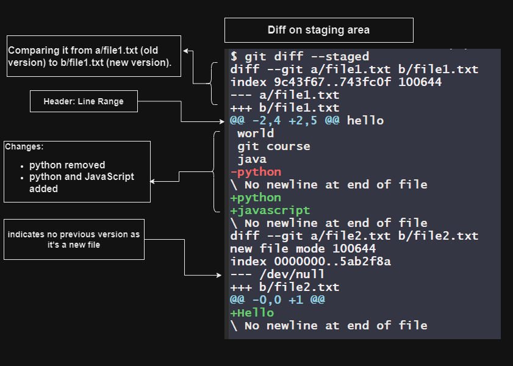

# Git Diff


One of its essential features is `git diff`, which helps you understand the differences between various versions of your files. Let's explore git diff using a simple example.

## Example Scenario

Imagine we have a project called `mars` with two files: `file1.txt` and `file2.txt`.

```
Mars/
├── file1.txt
└── file2.txt
```

`file1.txt` is already staged with the following content:

```plaintext
hello
world
git course
java
python
```

`file2.txt` is a newly added file and staged with:

```plaintext
Hello
```

Running `git status -s` shows:

```plaintext
M  file1.txt
A  file2.txt
```

We append javascript to `file1.txt`, making it:

```plaintext
hello
world
git course
java
python
javascript
```

Now, let's see the differences between the staged changes using git diff --staged.

```bash
git diff --staged
```

The output shows the differences between the staged changes:

```diff
diff --git a/file1.txt b/file1.txt
index 9c43f67..743fc0f 100644
--- a/file1.txt
+++ b/file1.txt
@@ -2,4 +2,5 @@ hello
 world
 git course
 java
-python
\ No newline at end of file
+python
+javascript
\ No newline at end of file

diff --git a/file2.txt b/file2.txt
new file mode 100644
index 0000000..5ab2f8a
--- /dev/null
+++ b/file2.txt
@@ -0,0 +1 @@
+Hello
\ No newline at end of file
```



- For `file1.txt`:
  - The changes are highlighted, showing the addition of 'python' and 'javascript'.
- For `file2.txt`:
  - The output indicates the addition of 'Hello'.


Next, let's add 'c++' to `file1.txt` and 'html' to `file2.txt`.

After making these changes, `git status -s` shows:

```plaintext
MM file1.txt
AM file2.txt
```

Now, let's see the differences in the working directory using git diff.

```bash
git diff
```

The output shows the differences between the working directory and the last commit:

```diff
diff --git a/file1.txt b/file1.txt
index 743fc0f..08087d0 100644
--- a/file1.txt
+++ b/file1.txt
@@ -3,4 +3,5 @@ world
 git course
 java
 python
-javascript
\ No newline at end of file
+javascript
+c++
\ No newline at end of file

diff --git a/file2.txt b/file2.txt
index 5ab2f8a..34d7664 100644
--- a/file2.txt
+++ b/file2.txt
@@ -1 +1,2 @@
-Hello
\ No newline at end of file
+Hello
+html
\ No newline at end of file
```

- For file1.txt:
  - The changes include the addition of 'javascript' and 'c++'.
- For file2.txt:
  - The changes include the addition of 'html'.


`git diff` is a powerful tool in Git that helps you understand the differences between various versions of your files. It's essential for tracking changes, reviewing modifications, and collaborating effectively on projects. By mastering git diff, you can gain better insights into your project's history and manage changes with confidence.