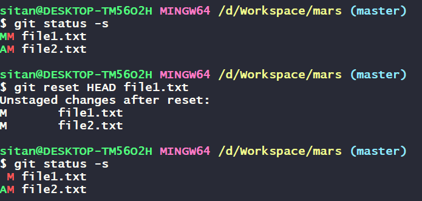
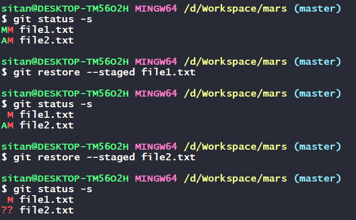

# Unstage a File in Git Before Committing


When working with Git, you might accidentally add files to the staging area that you don't want to commit just yet. Fortunately, you can easily unstage these files before making a commit. Let's walk through a scenario to understand how to do this step-by-step.

Let's say you have a project called `mars` with two files: `file1.txt` and `file2.txt`.

- `file1.txt` is already staged with some changes.
- `file2.txt` has been newly added to the staging area.

```
Mars/
├── file1.txt
└── file2.txt
```

When you check the status of your project using `git status -s`, you see:

```
MM file1.txt
AM file2.txt
```

Let's say you accidentally staged `file1.txt` with its latest changes, and now you want to unstage it.

## Using `git reset`

To remove `file1.txt` from the staging area, use the git reset command:

```sh
git reset HEAD file1.txt
```

After running the reset command, check the status again to ensure `file1.txt` has been unstaged:

```sh
git status -s
```

Output:

```
 M file1.txt
AM file2.txt
```

Now, `file1.txt` is no longer staged with its latest changes. The M indicates that file1.txt has modifications that are not staged. `file2.txt` remains in the staging area with its modifications.

### How `git reset` Works

- `git reset HEAD file1.txt` this command removes `file1.txt` from the staging area. It takes the content of `file1.txt` from the `last commit (from the repository)` and updates the staging area with that version, leaving your working directory (the current state of the files on your computer) unchanged. Essentially, this reverts the file in the staging area to how it was in the last commit, but your recent changes will still be present in your working directory.



To unstage all files in your project, use the following command:

```sh
git reset HEAD .
```

This command removes all changes from the staging area, but keeps the modifications in your working directory intact.

If you want to unstage specific types of files, such as all `.txt` files, you can use regular expressions with git reset HEAD:

```sh
git reset HEAD *.txt
```

This command unstages all `.txt` files in the staging area, while leaving other changes staged.


## Using `git restore`

You can achieve the same result using the `git restore` command.

To remove file1.txt from the staging area using git restore, use the following command:

```sh
git restore --staged file1.txt
```

This command removes file1.txt from the staging area.

After running the restore command, check the status again to ensure `file1.txt` has been unstaged:

```sh
git status -s
```

Output:

```
 M file1.txt
AM file2.txt
```

If you use `git restore` to unstage `file2.txt`, which was newly added and not present in the repository, the status output would reflect this change. Let's clarify how this would look:

Since `file2.txt` is newly added and not present in the repository, using `git restore` to unstage it would show as untracked `(??)` in the status:

```sh
git restore --staged file2.txt
```

`git restore --staged file2.txt` this command unstages `file2.txt` by removing it from the staging area. Since `file2.txt` was newly added and not present in the repository, it becomes untracked `(??)` in the status output. The changes in your working directory remain intact, but `file2.txt` is no longer staged for the next commit.



### How git restore Works
- `git restore --staged file1.txt` this command unstages `file1.txt` by removing it from the staging area. The changes in your working directory remain intact, but the file is no longer staged for the next commit.

Using the `git reset HEAD <file>` or `git restore --staged <file>` commands, you can easily unstage files from the staging area. These commands allow you to control exactly which changes you want to commit. By mastering these simple yet powerful commands, you'll have better control over your version control workflow in Git.