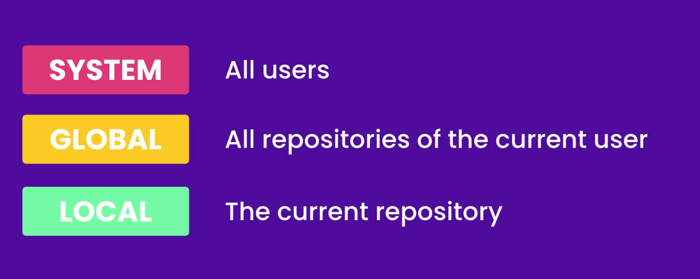
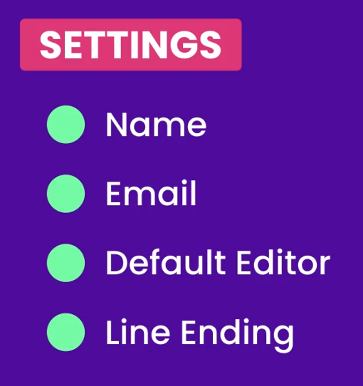
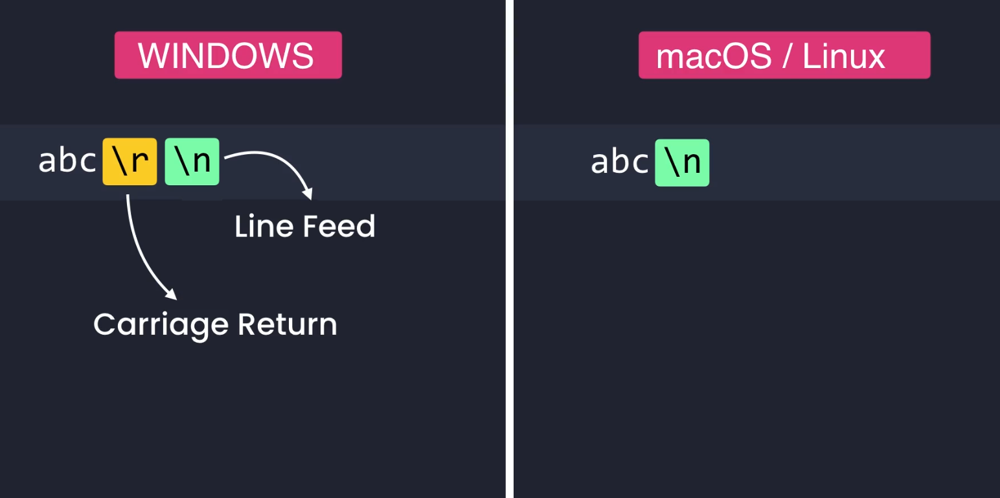
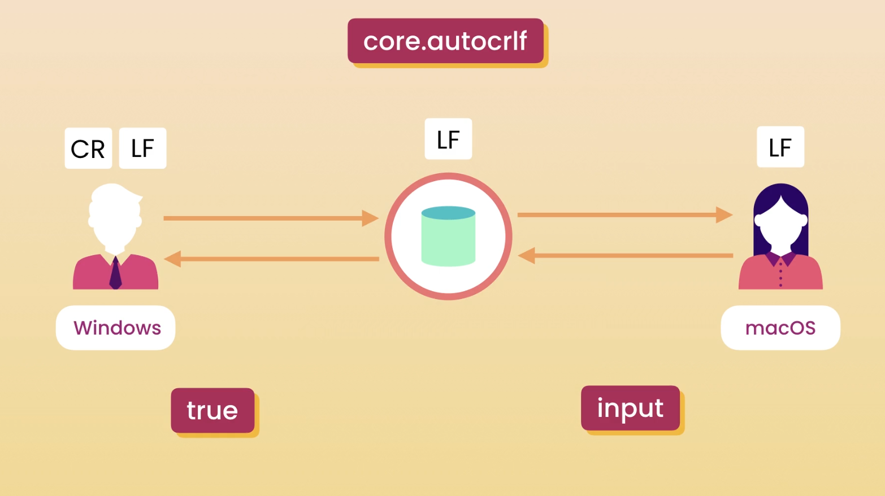
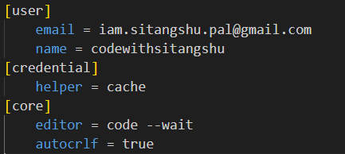

# Git Configuration


When you're working with Git, it's important to set up some basic configuration settings to ensure everything runs smoothly.

## Levels of Git Configuration

Git settings can be configured at three different levels: global, system, and local.



- Global Configuration:
  - Settings applied globally affect `all repositories` for a `specific user`. When you use the `--global` flag in your commands, you are setting preferences that apply to every project you work on from your user account.

- System Configuration:
  - `System-level` settings apply to `every user` on the computer and are configured in the `Git installation` folder. This is less commonly used for individual developers but can be useful in environments where multiple users share the same machine.

- Local Configuration:
  - Local settings apply only to the `specific repository` you’re working on. These settings override `global` and `system` configurations for that repository. To set local configurations, simply omit the `--global` flag:
  <p>

  ```bash
  git config user.name "local User name"
  ```

Understanding these levels helps you manage settings effectively and ensures that your Git environment behaves as expected across different projects and systems.

## Setting Up Your Global Configurations

These settings include things like your username, email, line endings, and default editor. Let’s go through how you can set these up and understand their importance.



### Username and Email:

Your username and email are used to identify the author of the commits. To set these globally (which means for all repositories on your computer), you use the following commands:
  <p>

  ```bash
  git config user.name "local User name"
  git config --global user.email "you@example.com"
  ```

### Line Endings:

When working with Git, it's important to understand how line endings can affect your project, especially when collaborating with others using different operating systems. Line endings are the invisible characters at the end of each line in a text file, and different systems handle them differently. Windows uses a carriage return followed by a line feed (CRLF), while macOS and Linux use just a line feed (LF).



This difference can cause issues when sharing code. To prevent problems, Git can automatically convert line endings to match the operating system you are working on. By setting `core.autocrlf` in your Git configuration, you can ensure that files are converted to the correct format on checkout and committed in a consistent format. This setting helps maintain a clean and compatible codebase across different environments. For example, you can use `git config --global core.autocrlf true` on Windows to convert LF to CRLF on checkout and back to LF on commit, ensuring consistency and preventing line ending issues.



```bash
git config --global core.autocrlf true  # On Windows
git config --global core.autocrlf input  # On macOS and Linux
```

### Default Editor:

When Git needs you to type in a message, like during a commit, it opens a text editor. You can set your preferred editor (e.g., Vim, Nano, VS Code) with:

```bash
git config --global core.editor "code --wait"  # For VS Code
```

Now we can open git global config using VS Code

```bash
git config --global -e
```




In summary, configuring Git properly is a small step that can save you a lot of hassle down the line. By setting up your global configurations for username, email, line endings,  default editor etc, you ensure a smoother workflow. And knowing the difference between global, system, and local settings helps you customize Git to suit your needs perfectly.