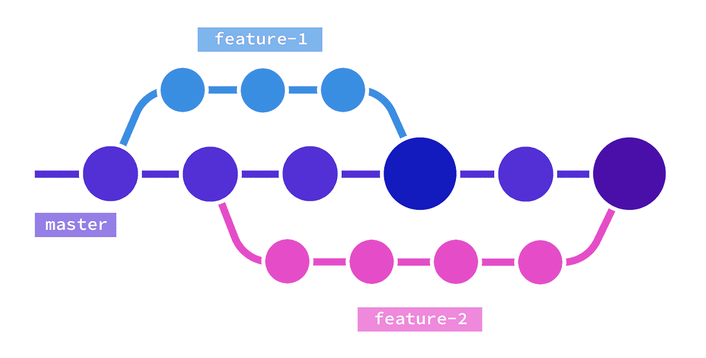
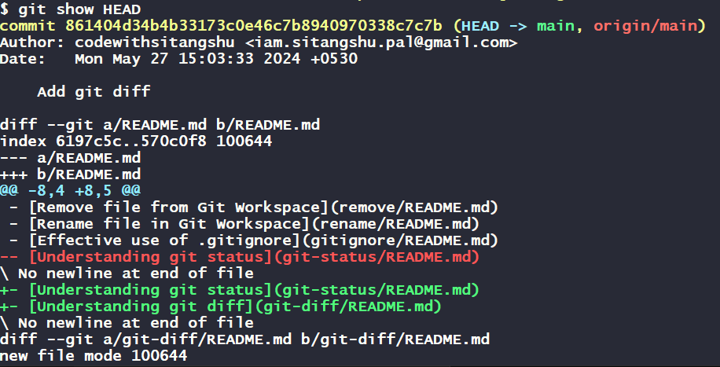
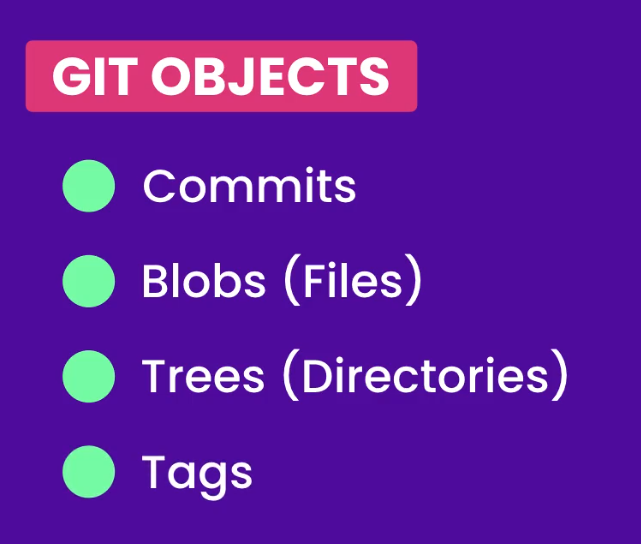

[Home](../../README.md)

# View History and Commit



## Viewing Commit History

To see the history of commits in your Git repository, you use the git log command. This command displays the commit history in reverse chronological order (most recent commits first).

```bash
git log
```

This command gives you detailed information about each commit, including the commit ID, author, date, and commit message.

```sql
commit 861404d34b4b33173c0e46c7b8940970338c7c7b (HEAD -> main, origin/main)
Author: codewithsitangshu <iam.sitangshu.pal@gmail.com>
Date:   Mon May 27 15:03:33 2024 +0530

    Add git diff

commit 8c6cac770a660a4361c987697959b2dec2abee90
Author: codewithsitangshu <iam.sitangshu.pal@gmail.com>
Date:   Mon May 27 11:45:29 2024 +0530

    Add git status

commit bfadda71d17b838ccfdebc8075797cb73078117f
Author: codewithsitangshu <iam.sitangshu.pal@gmail.com>
Date:   Mon May 27 10:39:56 2024 +0530

    Add .gitignore

commit 67fa682205afd3b87aed995a74f427df0940185d
Author: codewithsitangshu <iam.sitangshu.pal@gmail.com>
Date:   Sun May 26 12:11:07 2024 +0530

    Add Rename and Remove
```

- **Commit ID:** A unique identifier for the commit. Each commit ID is a `40-character SHA-1 hash` (e.g., 1a2b3c4d5e6f7g8h9i0jklmnopqrstuvwx1234567890).
- **Author:** The person who made the commit.
- **Date:** The date and time when the commit was made.
- **Commit Message:** A brief description of the changes made in the commit.

If a commit message is too long to fit on one screen, Git uses a pager to display the log. You can press the spacebar to move to the next page and `q` to quit the pager.

If you want to customize how the `pager` works, you can use the `--paginate` option explicitly:

```bash
git log --paginate
```

In Git, `HEAD` is a pointer to the latest commit in the current branch. It represents the current state of the repository. When you make new commits, `HEAD` moves to the latest commit. Typically, `HEAD` points to `main` (or `master` in some older repositories), indicating the most recent commit on the main branch.

### Using `--oneline` for a Concise History

If you want a more concise view of the commit history, you can use the --oneline option:

```bash
git log --oneline
```

This command displays each commit in a single line, showing the commit ID and the first part of the commit message:

```sql
861404d (HEAD -> main, origin/main) Add git diff
8c6cac7 Add git status
bfadda7 Add .gitignore
67fa682 Add Rename and Remove
0973837 Add git workflow first part
12d3ffc Add git configuration
98a5aa7 Update readme
ed21a58 Add CVC vs DVC
```

### Using `--reverse` to See Oldest First

By default, `git log` shows the most recent commits first. If you want to see the commits in chronological order (oldest commits first), you can use the `--reverse` option:

```bash
git log --reverse
```

You can combine options to customize the output further. For example, to see a concise, reversed commit history, you can use:

```bash
git log --oneline --reverse
```

Output

```sql
ed21a58 Add CVC vs DVC
98a5aa7 Update readme
12d3ffc Add git configuration
0973837 Add git workflow first part
67fa682 Add Rename and Remove
bfadda7 Add .gitignore
8c6cac7 Add git status
861404d (HEAD -> main, origin/main) Add git diff
```

## Viewing Specific Commit

To see the changes in the latest commit, you can use the `git show` command followed by `HEAD`. The `HEAD` represents the most recent commit in your current branch.

```sh
git show HEAD
```

This command will display all the changes made in the latest commit, including the files that were modified and the actual changes in the code.



Each commit in Git has a unique identifier (commit ID). If you know the commit ID, you can view the details of that specific commit. Use the git show command followed by the commit ID.

```sh
git show <commit-id>
```

Replace `<commit-id>` with the actual ID of the commit you want to view. For example:

```sh
git show <commit-id>
```

If you want to move to a specific commit from the latest commit, you can use HEAD~ followed by the number of commits you want to move back.

```sh
git show HEAD~<number>
```

Replace <number> with how many commits back you want to go. For example, to move back two commits:

```sh
git show HEAD~2
```

## Viewing a Specific File in a Commit

To see changes made to a specific file in the latest commit, use the following command with the file's full path:

```sh
git show HEAD:<path-to-file>
```

For example, to view changes in a file named index.html located in the src directory:

```sh
git show HEAD:src/index.html
```

## Understanding Project Structure in a Commit

Each commit in Git stores the entire project as it was at that point in time, not just the changes. To see the full project structure of a specific commit, you can use the `git ls-tree` command.

```sh
git ls-tree <commit-id>
```

This command will display the tree structure of the project, showing every node with its specific commit ID. Leaf nodes are stored as `blob` (individual files), and parent nodes are stored as `tree` (directories).



For example, to see the structure of a specific commit:

```sh
git ls-tree HEAD
```

Output

```sql
100644 blob 570c0f8b7905260aed1b9fbf157dc989fa95d74e    README.md
040000 tree 0e36da817041e41360317ec6289867f27579d4d7    configuration
040000 tree 670ccac5d65aac84905e5357e7ec33e477ab0691    cvc-dvc
040000 tree c04dc0517f36355be886987c6ee9370a08af5356    git-diff
040000 tree 2f817211420e5f8638b5100657d4c2eeafde2dfd    git-status
100644 blob 56ebf958c3e76c4ff839dcd632442e530f5fed67    git.gif
040000 tree d0b98335cdade9aa9b31de0516dcb66e0ff71a9e    gitignore
040000 tree 7aba3cb083361f49f4d547411ace3bea8fe30c4c    remove
040000 tree 566c69bf955c9e108c810ca264d30d6944f74b3a    rename
040000 tree 3c5f2ed9940fdcd9e3a9ed22fdffb6615b77cbaa    work-flow
```

You can also view a specific file in a specific commit by using the git show command with both the commit ID and the file path:

```sh
git show <commit-id>:<path-to-file>
```

For example, to view the `src/index.html` file in a specific commit:

```sh
git show 7aba3cb083361f49f4d547411ace3bea8fe30c4c:src/index.html
```

Using `git show`, `git log`, and `git ls-tree`, you can easily view and navigate through your commit history and project structure. These commands help you understand the changes made at each step and manage your project's history effectively. Whether you're looking at the latest commit, a specific commit, or even a specific file within a commit, Git provides the tools to explore and manage your codebase efficiently.

[Home](../../README.md)