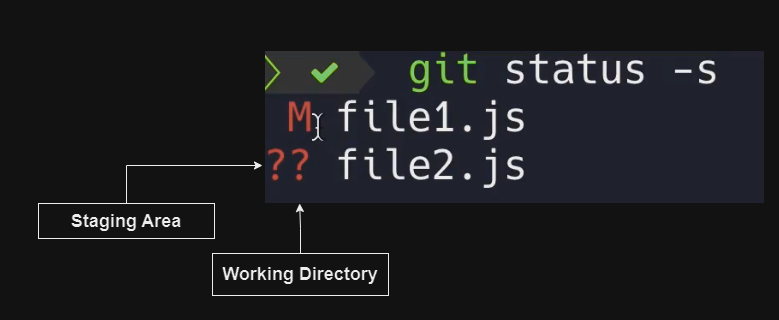

[Home](../../README.md)

# Understanding `git status` and How to Use `Short` Status in Git


When working with Git, the `git status` command is essential for understanding the current state of your project. However, the output can sometimes be quite detailed. Here, we'll learn how to get a short summary of the status and explain what the staging area and working directory are. Let's use an example with two files, `file1.txt` and `file2.txt`, to illustrate these concepts.

The `git status` command shows the state of the working directory and the staging area. It lets you see which changes have been staged, which haven't, and which files aren't being tracked by Git.

Let's say we have two files in our Git project: `file1.txt` and `file2.txt`.

- We have staged `file1.txt` for commit.
- We then modified `file1.txt` again after staging.
- `file2.txt` has not been staged yet.

First, let's check the status of our project:

```bash
git status
```

The output might be quite detailed:

```plaintext
On branch main
Changes to be committed:
  (use "git restore --staged <file>..." to unstage)
        modified:   file1.txt

Changes not staged for commit:
  (use "git add <file>..." to update what will be committed)
  (use "git restore <file>..." to discard changes in working directory)
        modified:   file1.txt

Untracked files:
  (use "git add <file>..." to include in what will be committed)
        file2.txt
```

To get a shorter, more concise status, we can use the `git status -s` or `git status --short` command:

```bash
git status -s
```

The short status output looks like this:

```plaintext
 M file1.txt
?? file2.txt
```

In this short status:

- `M file1.txt` indicates that `file1.txt` has modifications in the working directory that have not been staged.
- `?? file2.txt` indicates that `file2.txt` is an untracked file.

The short status output uses two columns to provide information about the files:

- The first column shows the status of the file in the staging area.
- The second column shows the status of the file in the working directory.



Now, let's stage `file2.txt`:

```bash
git add file2.txt
```

Check the short status again:

```bash
git status -s
```

The output will be:

```plaintext
 M file1.txt
A  file2.txt
```

In this short status:

- `M file1.txt` in the second column indicates that `file1.txt` has modifications in the working directory that are not staged.
- `A file2.txt` in the first column indicates that `file2.txt` is staged for the next commit.

Finally, let's commit the changes:

```bash
git commit -m "Commit staged changes"
```

After committing, if you check the status again:

```bash
git status -s
```

You might see:

```plaintext
 M file1.txt
```

This means:

- `M file1.txt` in the second column indicates that `file1.txt` still has changes in the working directory that have not been staged for commit.


## Summary
Using `git status` helps you keep track of changes in your project. The short status (`git status -s`) provides a concise overview, showing which files are modified, staged, or untracked. Understanding the staging area and working directory is crucial for efficient version control. By mastering these commands, you can better manage your Git workflow and keep your project organized.

[Home](../../README.md)