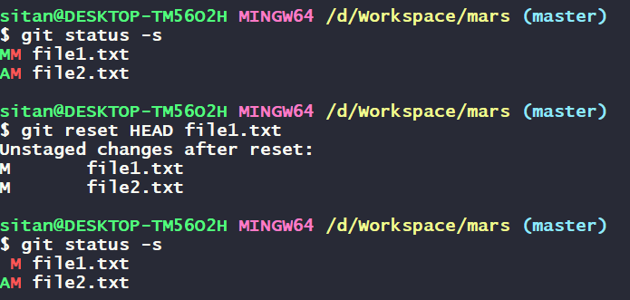
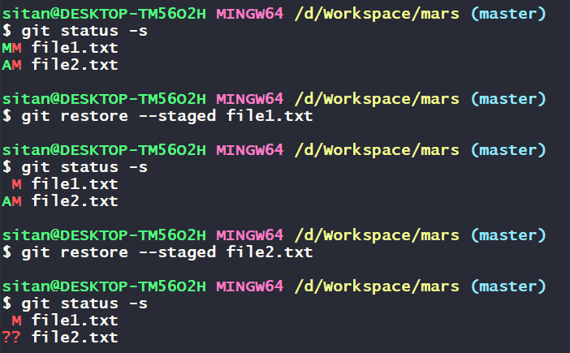
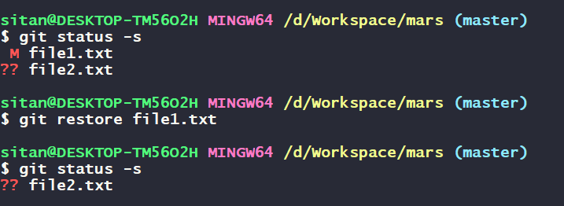
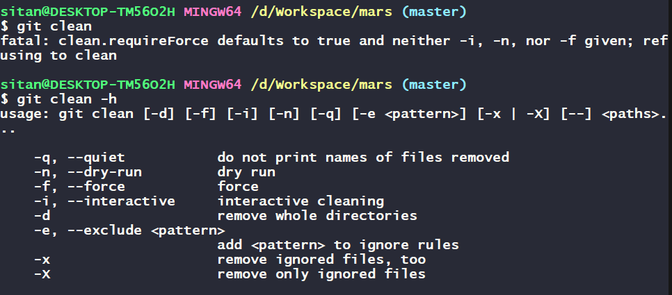
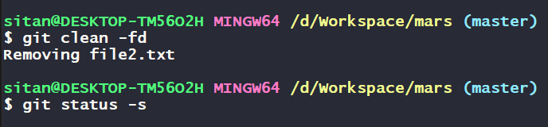
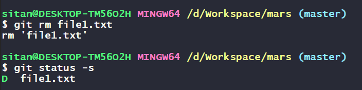
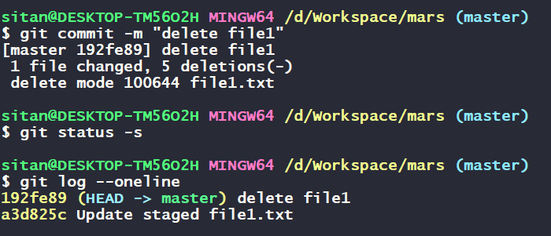
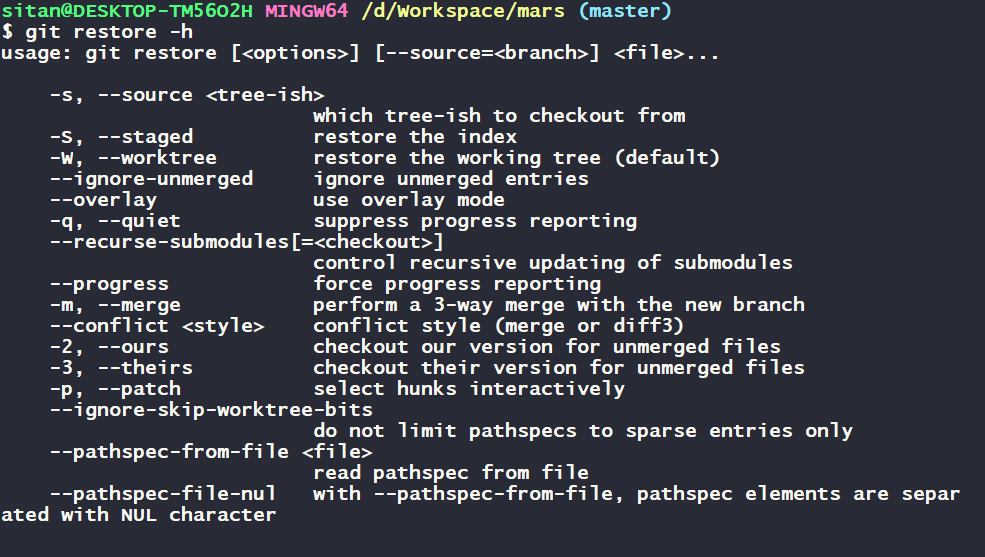
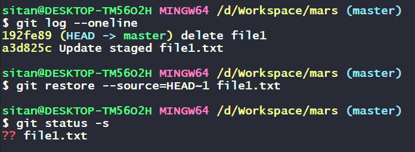

# Unstage a File in Git Before Committing


When working with Git, you might accidentally add files to the staging area that you don't want to commit just yet. Fortunately, you can easily unstage these files before making a commit. Let's walk through a scenario to understand how to do this step-by-step.

Let's say you have a project called `mars` with two files: `file1.txt` and `file2.txt`.

- `file1.txt` is already staged with some changes.
- `file2.txt` has been newly added to the staging area.

```
Mars/
├── file1.txt
└── file2.txt
```

When you check the status of your project using `git status -s`, you see:

```
MM file1.txt
AM file2.txt
```

Let's say you accidentally staged `file1.txt` with its latest changes, and now you want to unstage it.

## Using `git reset`

To remove `file1.txt` from the staging area, use the git reset command:

```sh
git reset HEAD file1.txt
```

After running the reset command, check the status again to ensure `file1.txt` has been unstaged:

```sh
git status -s
```

Output:

```
 M file1.txt
AM file2.txt
```

Now, `file1.txt` is no longer staged with its latest changes. The M indicates that file1.txt has modifications that are not staged. `file2.txt` remains in the staging area with its modifications.

### How `git reset` Works

- `git reset HEAD file1.txt` this command removes `file1.txt` from the staging area. It takes the content of `file1.txt` from the `last commit (from the repository)` and updates the staging area with that version, leaving your working directory (the current state of the files on your computer) unchanged. Essentially, this reverts the file in the staging area to how it was in the last commit, but your recent changes will still be present in your working directory.



To unstage all files in your project, use the following command:

```sh
git reset HEAD .
```

This command removes all changes from the staging area, but keeps the modifications in your working directory intact.

If you want to unstage specific types of files, such as all `.txt` files, you can use regular expressions with git reset HEAD:

```sh
git reset HEAD *.txt
```

This command unstages all `.txt` files in the staging area, while leaving other changes staged.


## Using `git restore`

You can achieve the same result using the `git restore` command.

To remove file1.txt from the staging area using git restore, use the following command:

```sh
git restore --staged file1.txt
```

This command removes file1.txt from the staging area.

After running the restore command, check the status again to ensure `file1.txt` has been unstaged:

```sh
git status -s
```

Output:

```
 M file1.txt
AM file2.txt
```

If you use `git restore` to unstage `file2.txt`, which was newly added and not present in the repository, the status output would reflect this change. Let's clarify how this would look:

Since `file2.txt` is newly added and not present in the repository, using `git restore` to unstage it would show as untracked `(??)` in the status:

```sh
git restore --staged file2.txt
```

`git restore --staged file2.txt` this command unstages `file2.txt` by removing it from the staging area. Since `file2.txt` was newly added and not present in the repository, it becomes untracked `(??)` in the status output. The changes in your working directory remain intact, but `file2.txt` is no longer staged for the next commit.



### How git restore Works
- `git restore --staged file1.txt` this command unstages `file1.txt` by removing it from the staging area. The changes in your working directory remain intact, but the file is no longer staged for the next commit.

Using the `git reset HEAD <file>` or `git restore --staged <file>` commands, you can easily unstage files from the staging area. These commands allow you to control exactly which changes you want to commit. By mastering these simple yet powerful commands, you'll have better control over your version control workflow in Git.

## Discard Local Changes Using `git restore`

Sometimes when working on a project, you make changes that you later decide you don't want to keep. Git provides a way to discard these local changes easily using the `git restore` command. Here we'll walk through an example scenario to demonstrate how to use git restore to revert changes in your project.

Based on above example, `file1.txt` has changes that were once staged and then unstaged. `file2.txt` has changes but was never added to the staging area.

Here's what the `git status -s` output looks like:

```sh
$ git status -s
 M file1.txt
?? file2.txt
```

This shows that `file1.txt` has modifications and `file2.txt` is an untracked file.

To discard the changes in `file1.txt` and revert it back to its last committed state, you can use the git restore command:

```sh
git restore file1.txt
```

Now, if you check the status again:

```sh
$ git status -s
?? file2.txt
```



`file1.txt` is no longer listed because its changes have been discarded, reverting it to its last committed state. However, `file2.txt` is still untracked and has local changes.

If you want to discard the changes in `file2.txt`, which is an untracked file, you'll need to use the `git clean` command. The `git clean` command removes untracked files from your working directory.

**Warning:** Using `git clean` is a dangerous operation as it permanently deletes untracked files and they cannot be recovered.

Before running the command, it's a good idea to see the available options by checking the help:

```sh
git clean -h
```



To discard the untracked file `file2.txt`, you can use the following command:

```sh
git clean -fd
```

Here, `-f` stands for "force" and `-d` stands for "directories". This command will delete all untracked files and directories in your working directory.

Now, let's check the status again:

```sh
git status -s
```



This should show no output, indicating that there are no more untracked or modified files.

By following these steps, you can ensure that your working directory is clean and only contains the files you want to keep. Always be cautious with `git clean` as it permanently deletes files without the possibility of recovery.

## Restore a File to an Earlier Version Using `git restore`

Have you ever deleted or modified a file in your project and then realized you need to get it back? With Git, this is easy! Git keeps track of every version of your files, so you can restore them to any previous state. Let's walk through how to do this with a practical example.

Imagine you have a project with a file named `file1.txt`. At some point, you delete this file but later realize you need it back. Here's how to restore it.

First, let's delete `file1.txt` using the `git rm` command, which removes the file from both the working directory and the staging area.

```sh
git rm file1.txt
```



Next, commit this change.

```sh
git commit -m "Delete file1.txt"
```

Let's say you realize deleting `file1.txt` was a mistake. To restore it, first check your commit history to find the commit before the deletion.

```sh
git log --oneline
```

You will see a list of commits, each with a unique `commit ID`. Find the commit ID of the commit just before the one that deleted `file1.txt`.



Now, use the `git restore` command to restore `file1.txt` to its previous version. You need to specify the `commit ID` or use a relative reference to identify the correct commit.

```sh
git restore --source=HEAD~1 file1.txt
```

Here, `HEAD~1` refers to the commit immediately before the current one.

Finally, check the status to confirm that `file1.txt` has been restored.

```sh
git status
```

You should see file1.txt listed as an untracked file if it was successfully restored.





The `git restore` command is powerful because it allows you to bring back files from previous commits without undoing your other changes. Here's how it works in this scenario:

- When you delete `file1.txt` and commit the change, Git saves this state as a new commit.
- By using `git restore --source=HEAD~1 file1.txt`, you tell Git to look at the commit before the last one `(HEAD~1)` and restore `file1.txt` from there.

This way, `file1.txt` is brought back to your working directory as it was in the specified commit, allowing you to continue working with it as needed.