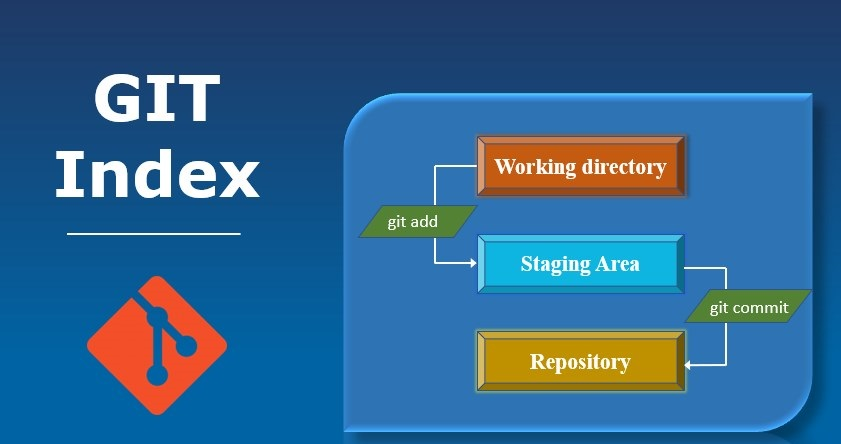

# Git Workflow


## Initialize a Git Repository

If you have a folder and you want to turn it into a Git repository, it’s easy to do! First, open your terminal or command prompt and navigate to your folder. Once you're inside the folder, type `git init`. This command sets up everything needed to start using Git in your folder.

```bash
git init
```

When you run git init, a new hidden folder named `.git` is created inside your folder. This `.git` folder is very important because it stores all the information about your Git repository, including all the changes you make, the history of those changes, and the configuration settings. You won’t see the `.git` folder unless you tell your computer to show hidden files, but it’s there doing all the work in the background to help you manage your project. Everything Git stores in the `.git` folder is part of Git's own architecture. You don’t need to understand how it works; Git handles everything automatically.


If you delete the `.git` folder, you will lose all the Git history and settings for your repository, and you would need to run `git init` again to reinitialize it.


## Workflow

Let's dive into a detailed Git workflow, covering the staging area, adding files, committing changes, and best practices for committing code.

### Staging Area

The Git staging area, also known as the index, is a space where you can gather changes before committing them to your repository. Think of it as a buffer zone where you can decide which changes should be included in the next commit.



### Adding Files to the Staging Area

To add files to the staging area, you use the git add command. For example, if you've modified a file named `example.txt`, you can stage it with:

```bash
git add example.txt
```

If you want to stage all the changes in your directory, you can use:

```bash
git add .
```

Also you can use regular expression.

```bash
git add '*.txt'
```

When you run `git add`, Git takes a snapshot of the changes in your working directory and moves them to the staging area. These changes are now ready to be committed.

### Deleting Files from the Staging Area

If you delete a file from your local directory and want to stage this deletion, you need to use the `git add` command again:

```bash
git rm example.txt
```

This command stages the file for deletion. If you want to unstage a file (remove it from the staging area), you can use:

```bash
git reset example.txt
```

### How Git Tracks Changes

Git tracks changes by creating snapshots of your files. Instead of storing the differences (deltas) between versions, Git stores the complete state of your files at each commit. This approach might seem space-consuming, but Git uses compression techniques to minimize the storage required, making it efficient even for large projects.


### Committing Changes

Once your changes are staged, you can commit them to your repository with the `git commit` command. Each commit is a record of changes in your project. To commit your changes, use:

```bash
git commit -m "Your commit message"
```

The `-m` flag allows you to add a commit message, which is a brief description of the changes.

### Anatomy of a Commit

A commit in Git includes several key components:

- Commit ID (SHA-1 hash): A unique identifier for the commit.
- Author: The person who made the changes.
- Date/Time: When the commit was made.
- Commit Message: A description of what changes were made.
- Complete Snapshot: Git stores the complete state of your files at the time of the commit, allowing you to revert back to this exact state if needed.


### Writing a Good Commit Message

A good commit message should be clear, concise, and descriptive. It typically follows this format:

- Summary Line: A brief summary of the changes (50 characters or less). Use the imperative mood (e.g., "Fix", "Add", "Update") to describe what the commit does.

Example: Fix issue with user login validation

- Body: Optionally, provide a more detailed explanation of the changes, if necessary. Describe why the change is needed and any relevant details.

Example:

```css
- Corrected the validation logic for user credentials
- Updated the login form to display error messages when credentials are incorrect
```

### Best Practices for Committing Code

Frequent commits are a good practice in Git. Committing often helps you track your progress and makes it easier to identify and fix issues. However, avoid committing too frequently with very small changes, as this can clutter your project history.

A good rule of thumb is to commit logically related changes together. Each commit should represent a single purpose or task. For example, if you're fixing a bug and adding a new feature, create separate commits for each.

By following these practices, you can maintain a clean and organized project history, making it easier to manage and collaborate on your code.